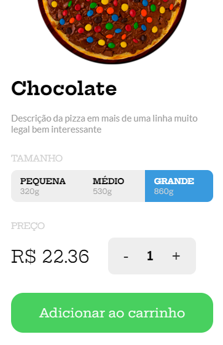

# Compras_de_Pizza

<h3>Projeto de E-commerce de compras de Pizza<h3>

<h4>O objetivo do projeto foi desenvolver um pequeno sistema de compras, com o objetivo
de buscar eventos ocorridos em tela, para determinar ações.<h4>

<h4>As tecnologias utilizadas neste projeto até o momento, estão sendo:<h4>
  <ul>
      <li>HTML5</li>
      <li>Css3</li>
      <li>JavaScript</li>
 </ul>
    

<h1>Screenshot Página Inicial<h1>

 

<h1>Screenshot  Modal<h1>

 

<h1>Screenshot  Carrinho<h1>

 

<h1>Screenshot Modal Mobile<h1>

 

<h1>Screenshot Carrinho Mobile<h1>

 

